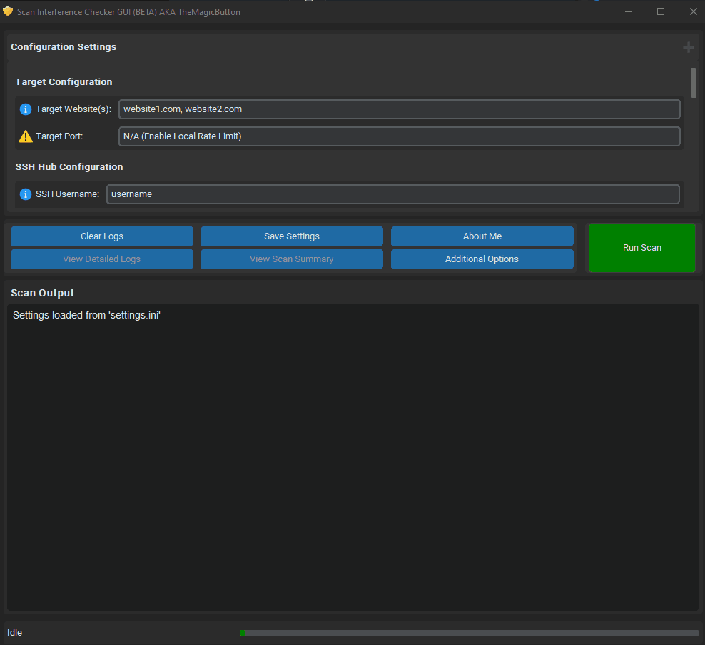
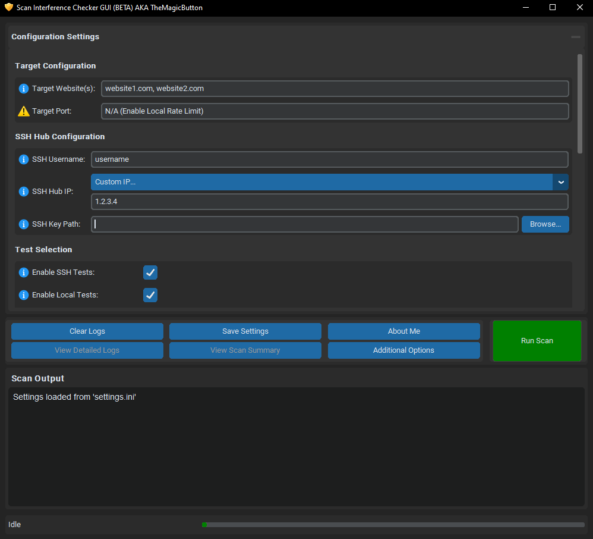
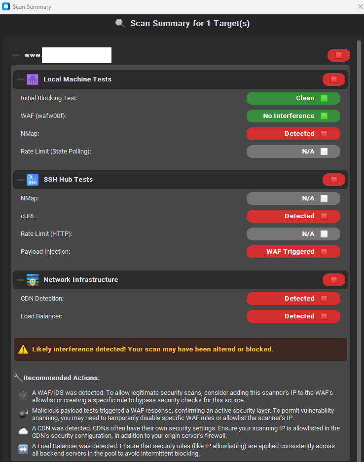
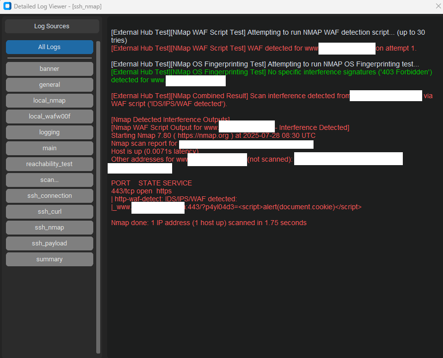
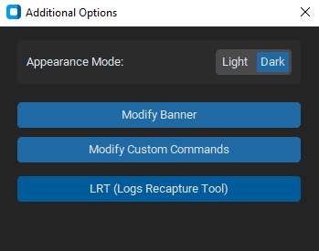
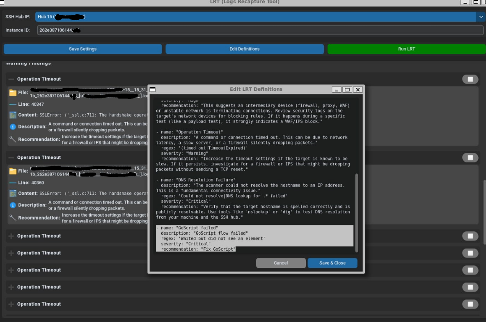
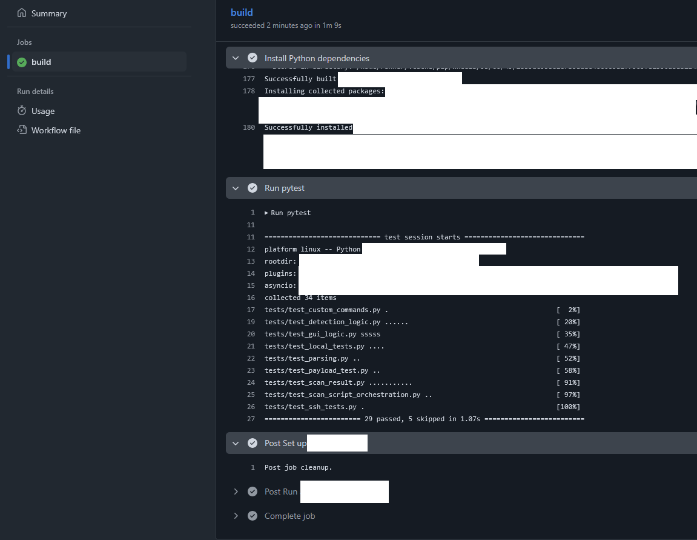

# Scan Interference Checker (SIC) GUI AKA TheMagicButton

[](https://github.com/duchuyb/SIC_tool_GUI/actions/workflows/python-tests.yml)

**Version:** 1.3.23 (21/07/2025)

A comprehensive Python-based graphical tool designed to detect network interferences such as Firewalls, WAFs, IDS/IPS, Load Balancers, and CDNs. It offers a unique dual-perspective analysis, running tests from both your local machine and a remote SSH hub to provide a complete picture of the target's security posture.

---

## Table of Contents

1.  [Preview](#preview)
2.  [Features](#features)
3.  [Getting Started with Docker](#getting-started-with-docker)
4.  [Configuration](#configuration)
5.  [Changelog](#changelog)
6.  [To-Do List](#to-do-list-next-release)

---

## Preview

A quick look at the SIC GUI in action, from configuration to the final summary report.

<p align="center">
  
</p>

Here are some key parts of the interface:

<p align="center">
  
  &nbsp; &nbsp;
  
  &nbsp; &nbsp;
  
  &nbsp; &nbsp;
  
  &nbsp; &nbsp;
  
  &nbsp; &nbsp;
  
</p>

---

## Features

#### **Core Analysis & Detection Capabilities**

*   **Dual-Perspective Scanning:** Run tests from both your **local machine** and a **remote SSH hub** to compare results and identify location-based blocking or interference.
*   **Multi-Target Scanning:** Efficiently scan multiple websites or IPs in a single session by providing a comma-separated list of targets.
*   **Initial Block & Reachability Test:** Performs a quick, direct connection test to determine if your IP is firewalled before running more intensive scans. It can optionally use public proxies to differentiate a targeted block from a general network issue.
*   **Comprehensive CDN Detection:** Identifies Content Delivery Networks by analyzing DNS records (CNAMEs), performing reverse DNS lookups on target IPs, and inspecting HTTP headers for known CDN signatures.
*   **Load Balancer Detection:** Automatically detects the presence of a load balancer by analyzing if multiple requests to the target are resolved to different IP addresses.
*   **Dual-Mode Rate-Limit Testing:** Detects rate-limiting using two distinct methods:
    *   **Local:** A TCP connection flood from your machine to test for network-level limits (e.g., by a firewall).
    *   **Remote:** An HTTP request flood from the SSH hub to test for application or WAF-level limits.
*   **Advanced cURL Analysis (SSH):** Sends requests from the SSH hub to analyze HTTP headers for security signatures, detect redirects, and identify potential rate-limiting headers.
*   **Nmap WAF & Fingerprint Scanning:** Integrates Nmap's powerful scripting engine to run WAF detection and service fingerprinting scans from both local and remote perspectives.
*   **Payload Injection Testing (SSH):** Actively probes the target by sending a variety of encoded payloads (XSS, SQLi, etc.) from the SSH hub to test for WAF, IDS, or IPS responses.
*   **Local WAF Detection (wafw00f):** Integrates the popular `wafw00f` tool to perform an initial WAF detection from your local machine.
*   **HTTP Basic Authentication Support:** Automatically includes Basic Auth credentials in relevant tests (cURL, Payload Injection) for scanning sites protected by a login prompt.

#### **User Interface & Reporting**

*   **Modern Graphical User Interface:** A clean, intuitive GUI built with CustomTkinter, featuring light/dark modes, helpful tooltips, and a responsive layout for managing all settings and viewing results.
*   **Interactive Summary Report:** After each scan, a detailed, expandable summary report is generated. It provides a clear verdict, breaks down findings by category (Local, SSH, Network), and offers actionable recommendations based on the detected interference.
*   **Real-time & Detailed Logging:** View scan output in real-time in the main window. After a scan, use the detailed log viewer to filter and inspect the output from specific test modules (e.g., cURL, Nmap, CDN Detection).
*   **Persistent File Logging:** Optionally save a complete, timestamped log file for each scan to a local `logs` directory for archival and later review.

#### **Configuration & Customization**

*   **Flexible Test Configuration:** Easily enable or disable specific tests and features through the graphical interface. All settings are saved to a persistent `settings.ini` file.
*   **Remote Hub Management:** Connect to pre-configured SSH hubs or specify a custom IP for remote testing. The tool supports both key-based and SSH-agent authentication.
*   **In-App Editors:**
    *   Personalize the tool's aesthetics by modifying the startup banner.
    *   Define your own sequence of shell commands to be executed on the SSH hub.

---

## Getting Started with Docker

This application is distributed as a Docker image, which includes all necessary dependencies. To run the GUI on your host machine, you will need to forward your display server to the container.

### 1. Pull the Docker Image

Pull the latest image from Docker Hub:
```bash
Please contact the developer for the latest Docker image and setup instructions.
```

### 2. Prepare Host Directories

For the application to save settings, generate logs, and use your custom files, you should create a local directory and the necessary files.

```bash
mkdir sic-data
cd sic-data
touch settings.ini
mkdir logs
```
*   **`settings.ini`**: The tool will be populated with default settings on the first run if this is empty. You can then use the "Save Settings" button in the GUI.
*   **`logs/`**: This directory will store the timestamped log files from your scans.

### 3. Running the Container

The command to run the container varies slightly depending on your operating system.

#### On Linux

You need to share your X11 socket with the container.

```bash
docker run -it --rm \
  -e DISPLAY=$DISPLAY \
  -v /tmp/.X11-unix:/tmp/.X11-unix \
  -v $(pwd)/settings.ini:/app/settings.ini \
  -v $(pwd)/logs:/app/logs \
  -v ~/.ssh:/root/.ssh:ro \
  username/project:latest
# IMPORTANT: Contact the developer or administrator to obtain the correct Docker image name and setup instructions.
```

*Note on SSH keys:* The example above mounts your `~/.ssh` directory as read-only into the container. In the GUI's "SSH Key Path" setting, you would then use the path `/root/.ssh/id_rsa` (or the name of your key file).

#### On macOS (with XQuartz)

1.  Install and run XQuartz.
2.  In XQuartz preferences, go to the "Security" tab and make sure "Allow connections from network clients" is checked.
3.  Get your local IP address: `ip=$(ifconfig en0 | grep "inet " | cut -d " " -f2)`
4.  Allow connections from your local IP: `xhost + $ip`

Now, run the container:
```bash
docker run -it --rm \
  -e DISPLAY=$ip:0 \
  -v $(pwd)/settings.ini:/app/settings.ini \
  -v $(pwd)/logs:/app/logs \
  -v ~/.ssh:/root/.ssh:ro \
  username/project:latest
# IMPORTANT: Contact the developer or administrator to obtain the correct Docker image name and setup instructions.
```

#### On Windows (with WSL2 and WSLg)

If you are using Windows 11 or a recent version of Windows 10 with WSL2 and WSLg (which provides GUI app support out-of-the-box), the process is simpler. Run the following command from your WSL2 terminal:

```bash
# Make sure you are in your sic-data directory within WSL
docker run -it --rm \
  -e DISPLAY=$DISPLAY \
  -v /mnt/wslg/.X11-unix:/tmp/.X11-unix \
  -v $(pwd)/settings.ini:/app/settings.ini \
  -v $(pwd)/logs:/app/logs \
  -v ~/.ssh:/root/.ssh:ro \
  username/project:latest
# IMPORTANT: Contact the developer or administrator to obtain the correct Docker image name and setup instructions.
```
*Note:* The path `$(pwd)` must be the WSL path to your data directory (e.g., `/home/youruser/sic-data`).

---

## Configuration

All settings are managed through the GUI and saved to the `settings.ini` file you mounted into the container. Key configuration groups include:

*   **`[Target Configuration]`**: Specify the target website(s) and the port for the local rate-limit test.
*   **`[SSH Hub Configuration]`**: Configure the username, IP address, and the path to your SSH key (e.g., `/root/.ssh/id_rsa` inside the container).
*   **`[Test Selection]`**: Master toggles to enable or disable major test categories.
*   **`[Advanced Options]`**: Enable experimental or resource-intensive features.
*   **`[Basic Authentication]`**: Provide credentials for sites protected by HTTP Basic Auth.

The GUI provides tooltips for each option explaining its purpose in detail.

---

## Changelog

### v1.3.23 (21/07/2025)

This release introduces major UI/UX enhancements, more flexible configuration, and significantly improved reporting and logging capabilities.

#### ✨ New Features & Enhancements
*   **Multi-Target Scanning:** The tool now supports scanning multiple websites in a single session. Simply provide a comma-separated list in the target field.
*   **Multi-Port Rate Limiting:** The local rate-limit test now accepts multiple ports (e.g., `443,80`) to test different services simultaneously.
*   **Configurable Rate-Limiting:** Users can now set a custom request limit for the remote (SSH) HTTP flood test and unlock the hard limit via an advanced option.
*   **In-App Editors:** Added simple, native editors for customizing the startup banner and modifying shell commands, removing the need for external applications.
*   **CLI Scan Summary:** The command-line interface now generates a detailed scan summary report, mirroring the GUI's output format.
*   **File Logging Toggle:** Added a setting to enable or disable persistent file logging (disabled by default).

#### 🐛 Bug Fixes & Performance
*   **Reachability Test:** The initial "Ping Test" has been refactored into a more reliable "Reachability Test" to better handle environments where ICMP is blocked.
*   **Rate-Limit Logic:** Improved the logic for detecting rate-limiting headers in the cURL test for more accurate results.
*   **Scan Stability:** Implemented a more aggressive timeout for Nmap scans to prevent them from hanging indefinitely.
*   **Scan Interruption:** The "Stop" button is now more responsive, significantly reducing the delay when aborting a running scan.
*   **Docker Logging:** Fixed a critical bug that prevented scan logs from being correctly written to the mounted volume when running inside a Docker container.
*   **Multi-Target Logging:** Log files now correctly capture and store results from multi-target scans.

#### 🎨 UI & UX Improvements
*   **SSH Hub Selection:** Replaced the manual IP entry with a convenient dropdown menu to select from pre-configured SSH hubs.
*   **Revamped Scan Summary:** The summary report pop-up has been completely redesigned with clearer color-coding, new icons, and a dynamic, scalable layout that properly handles multi-target results and provides more specific recommendations.
*   **Collapsible Settings:** Advanced options and command editors are now grouped in collapsible sections, decluttering the main interface.
*   **Dependent Options:** UI elements are now intelligently disabled (with a warning icon and tooltip) when their parent test category is turned off.
*   **Informative Tooltips:** Added detailed tooltips to every configuration option, clearly explaining its purpose and usage.
*   **Visual Feedback:** A spinner icon is now displayed during scans to provide clear visual feedback that the application is busy.
*   **Input Handling:** Added stricter validation for the target input field. Pasting a URL now correctly overwrites the existing content.
*   **Log Viewer:** The detailed log viewer now includes more filters, allowing for easier inspection of specific test outputs like payload injection results.
*   **Theme Toggle:** Added a dedicated option to switch between light and dark modes.
*   **Scrolling:** Fixed an issue where the main view was not immediately scrollable with the mouse wheel.

---

### v1.2.22 (30/06/2025)

This was the first major release featuring the full graphical user interface and a completely overhauled testing engine.

#### ✨ New Features & Enhancements
*   **Graphical User Interface:** Introduced the initial version of the GUI for managing scans, configuring settings, and viewing results.
*   **Basic Authentication:** Added support for HTTP Basic Authentication for sites protected by a login prompt.
*   **OS Fingerprinting:** Integrated an Nmap-based OS fingerprinting check into the remote scan.
*   **Configurable Block Test:** Added an option to enable or disable the initial IP block test.

#### 🐛 Bug Fixes & Performance
*   **Graceful Shutdown:** Resolved asyncio errors that occurred when aborting a scan abruptly.
*   **Data Handling:** Fixed errors in CDN and Load Balancer checks when expected data was not returned.
*   **Load Balancer Logic:** Corrected the load balancer detection to accurately report all resolved IP addresses.
*   **SSH Authentication:** Improved SSH logic to correctly use local WSL keys or SSH agents within Docker.
*   **Nmap Pathing:** Resolved an issue where Nmap could not be found on Windows by checking the local WSL path.
*   **DNS Resolution:** Fixed a bug causing excessive error messages and failures on DNS lookups for unknown services.
*   **UI Stability:** Fixed a race condition that prevented the "About" and "Detailed Log Viewer" windows from opening correctly.

#### 🎨 UI & UX Improvements
*   **Scan Summary Pop-up:** Introduced a new pop-up window for displaying a detailed scan summary, complete with a verdict, checklist, and actionable recommendations.
*   **Detailed Log Viewer:** Added a new window to view and inspect detailed logs from individual tests.
*   **Color-Coded Feedback:** Implemented color-coding in the GUI and summary report to indicate success, warnings, and failures.
*   **System Theme Sync:** The application now automatically adapts to the system's light/dark mode setting.
*   **Dynamic "Run/Stop" Button:** The "Run Scan" button now dynamically changes to "Stop Scan" during a scan.
*   **Collapsible Sections:** Introduced collapsible sections for grouped tests and settings in the UI.
*   **Layout Redesign:** Reorganized the button layout to improve usability and accommodate the new log viewer button.

#### ⚙️ Refactoring & Maintenance
*   **Rate-Limiting Engine:** Completely rewrote the rate-limiting module for more aggressive and concurrent testing via local port polling and remote HTTP flooding.
*   **Experimental Feature Logic:** Revamped the logic for the experimental feature to halt tests and generate an immediate report upon WAF detection.
*   **Settings Structure:** Refactored the `settings.ini` file format for better organization and clarity.
*   **Nmap Configuration:** Tuned Nmap scan parameters for more aggressive and faster execution.
*   **Configuration Flow:** Removed the manual "Load from settings.ini" button, as settings are now loaded automatically on startup.

---

## To-Do List (Next Release)

- [ ] **Code Coverage:** Integrate a code coverage tool (like `pytest-cov`) into the CI pipeline to measure test effectiveness.
- [ ] **LRT (Logs Recapture Tool):** Full implementation of a tool that captures logs and automatically attempts to find meaning (in a seperate `lrt` folder)
- [x] **HTTP Method Tampering:** Implemented a new test to detect interference by sending various HTTP methods (`OPTIONS`, `PUT`, etc.) and comparing responses to a `GET` baseline.
- [x] **Pytest Suite:** Implemented a comprehensive test suite using `pytest` to cover core application logic, including unit tests for parsing functions and integration tests for scan modules.
- [x] **Continuous Integration:** Set up a GitHub Actions workflow to automatically run all tests on every push and pull request, ensuring code quality and preventing regressions.
- [x] **Bug Fixes:** Corrected detection logic for `wafw00f` and `nmap` to improve accuracy and reliability as part of the testing implementation.
